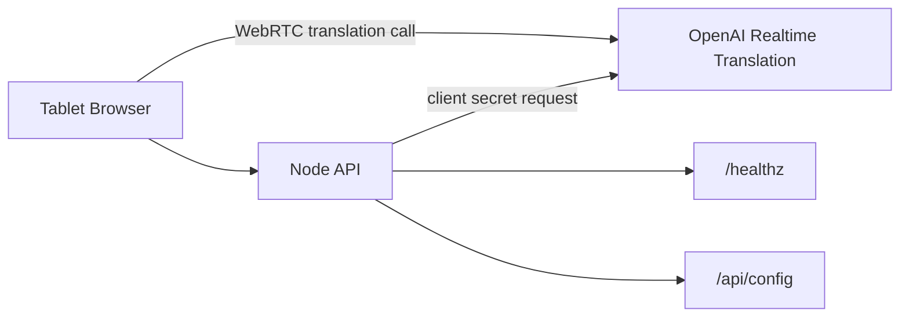

# Realtime Translation MVP - Implementation Plan v1

Author: Codex
Date: 2026-05-14
Sprint Length: 1 week
Team Size: 1-2 engineers
Target Completion: 4 weeks

## Architecture

### System Overview

Build a Docker-ready tablet web app for Japanese-to-Korean face-to-face interpretation. The frontend captures microphone audio and connects to OpenAI Realtime Translation through WebRTC. The backend protects the OpenAI API key and creates short-lived translation client secrets.

### Component Diagram



### Components

#### Component: Web App

Responsibility: Meeting console, microphone capture, WebRTC connection, audio playback, caption rendering, and user-facing error states.

Technology: React, Vite, TypeScript.

Interfaces:

- `POST /api/realtime/session`: request short-lived client secret.
- Browser WebRTC APIs: microphone capture, peer connection, remote audio track playback.

Configuration:

- `PUBLIC_API_BASE_URL`
- default source language `ja`
- default target language `ko`

#### Component: API Server

Responsibility: Server-side OpenAI credential use, translation session creation, config response, health check, and later metrics.

Technology: Node.js, Express, TypeScript.

Interfaces:

- `POST /api/realtime/session`
- `GET /api/config`
- `GET /healthz`

Configuration:

- `OPENAI_API_KEY`
- `OPENAI_REALTIME_TRANSLATION_MODEL`
- `SOURCE_LANGUAGE`
- `TARGET_LANGUAGE`
- `SESSION_MAX_MINUTES`

#### Component: Docker Runtime

Responsibility: Package web and API services so production deployment can use the same process boundaries as local development.

Technology: Docker, Docker Compose, nginx or static Node server.

Interfaces:

- `docker-compose.yml`
- `.env.example`
- container health checks

## Task Breakdown

### Phase 1: Foundation

#### TASK-001: Scaffold Monorepo

Type: Infrastructure
Priority: P0
Estimate: 3 points
Dependencies: None

Acceptance Criteria:

- `apps/web` and `apps/api` exist.
- TypeScript is configured for both apps.
- Root scripts can run web and API separately.
- `.env.example` documents required environment variables.

#### TASK-002: API Health And Config Endpoints

Type: Implementation
Priority: P0
Estimate: 2 points
Dependencies: TASK-001

Acceptance Criteria:

- `GET /healthz` returns a simple healthy response.
- `GET /api/config` returns source language, target language, and public defaults.
- Config loads from environment variables with safe local defaults where appropriate.

#### TASK-003: Docker-Ready Project Skeleton

Type: Infrastructure
Priority: P0
Estimate: 3 points
Dependencies: TASK-001, TASK-002

Acceptance Criteria:

- API has a production Dockerfile.
- Web has a production Dockerfile or documented static build target.
- `docker-compose.yml` wires web and API services.
- API service includes a health check.

### Phase 2: Realtime Translation Path

#### TASK-004: Translation Session API

Type: Implementation
Priority: P0
Estimate: 5 points
Dependencies: TASK-002

Acceptance Criteria:

- `POST /api/realtime/session` creates a short-lived OpenAI Realtime Translation client secret.
- The standard OpenAI API key remains server-side only.
- Request validation limits source and target to MVP defaults unless explicitly expanded.
- API errors are returned in a user-safe format.

#### TASK-005: WebRTC Client Connection

Type: Implementation
Priority: P0
Estimate: 8 points
Dependencies: TASK-004

Acceptance Criteria:

- Browser requests microphone permission after a Start gesture.
- Browser creates a WebRTC peer connection using the session client secret.
- Japanese microphone audio is sent to the translation session.
- Korean translated audio plays through the tablet.
- Stop closes tracks and peer connection cleanly.

#### TASK-006: Live Caption Rendering

Type: Implementation
Priority: P0
Estimate: 5 points
Dependencies: TASK-005

Acceptance Criteria:

- Korean caption deltas render in the active session view.
- Captions are readable in tablet portrait and landscape layouts.
- Japanese source transcript is available behind a simple toggle if events provide it.

### Phase 3: Meeting UX And Reliability

#### TASK-007: Tablet Meeting Console UI

Type: Implementation
Priority: P1
Estimate: 5 points
Dependencies: TASK-005, TASK-006

Acceptance Criteria:

- Idle, connecting, active, error, and stopped states are visually distinct.
- Start, Stop, mute, and transcript toggle controls are touch-friendly.
- UI avoids marketing/landing page structure and opens directly to the console.

#### TASK-008: Error And Reconnection Handling

Type: Implementation
Priority: P1
Estimate: 5 points
Dependencies: TASK-005

Acceptance Criteria:

- Microphone permission errors are explained clearly.
- Session creation failures are visible to the user.
- Connection failure closes local media tracks.
- User can retry without refreshing the page.

#### TASK-009: Glossary Configuration

Type: Implementation
Priority: P2
Estimate: 3 points
Dependencies: TASK-004

Acceptance Criteria:

- API can load a company glossary JSON file.
- Session creation includes glossary/context instructions when configured.
- App still works when no glossary exists.

### Phase 4: Verification And Internal Rollout Prep

#### TASK-010: Automated Tests

Type: Testing
Priority: P1
Estimate: 5 points
Dependencies: TASK-002, TASK-004, TASK-007

Acceptance Criteria:

- API config and session validation tests exist.
- Web UI state tests exist for idle, connecting, active, and error states.
- Tests run from the root command.

#### TASK-011: Browser And Device Smoke Tests

Type: Testing
Priority: P1
Estimate: 3 points
Dependencies: TASK-005, TASK-006, TASK-007

Acceptance Criteria:

- Smoke test checklist covers desktop Chrome and target tablet browser.
- Microphone permission, audio playback, captions, and stop/retry are verified.
- Known device limitations are documented.

#### TASK-012: Deployment Notes

Type: Documentation
Priority: P1
Estimate: 2 points
Dependencies: TASK-003, TASK-010

Acceptance Criteria:

- README documents local dev startup.
- README documents Docker Compose startup.
- README warns that HTTPS is required for production microphone/WebRTC use.
- `.env.example` is complete.

## Dependency Graph

```text
TASK-001
  -> TASK-002
      -> TASK-004
          -> TASK-005
              -> TASK-006
              -> TASK-007
              -> TASK-008
          -> TASK-009
  -> TASK-003
TASK-002 + TASK-004 + TASK-007 -> TASK-010
TASK-005 + TASK-006 + TASK-007 -> TASK-011
TASK-003 + TASK-010 -> TASK-012
```

Critical path: TASK-001 -> TASK-002 -> TASK-004 -> TASK-005 -> TASK-006/TASK-007 -> TASK-011.

## Sprint Schedule

| Sprint | Focus | Deliverable |
| --- | --- | --- |
| 1 | Foundation and Docker skeleton | Web/API scaffold, health/config endpoints, Docker Compose baseline |
| 2 | Realtime path | Session minting, WebRTC microphone streaming, Korean audio playback |
| 3 | Meeting UX | Captions, tablet console, retry/error handling, glossary support |
| 4 | Verification and rollout prep | Tests, device smoke test, deployment notes |

## Risk Assessment

| Risk | Impact | Probability | Mitigation |
| --- | --- | --- | --- |
| WebRTC behavior differs by tablet browser | High | Medium | Test target tablet early in Sprint 2. |
| Production microphone access fails without HTTPS | High | Medium | Require TLS in deployment notes and reverse proxy plan. |
| Translation quality suffers from room noise | High | Medium | Support external microphone selection and test with real meeting conditions. |
| API key accidentally exposed in frontend | High | Low | Keep OpenAI calls requiring standard API key only in API server; inspect built frontend env. |
| Cost grows during long idle sessions | Medium | Medium | Add session duration guardrail and obvious Stop control. |

## Success Metrics

- Japanese speech produces audible Korean translation on the tablet.
- Korean captions remain readable from meeting-table distance.
- Start-to-active setup takes under 10 seconds in normal network conditions.
- User can stop and restart a session without page refresh.
- Docker Compose can start the production-shaped services.

## Next Steps

1. Initialize the monorepo scaffold.
2. Implement API health/config endpoints.
3. Add Docker Compose baseline before Realtime integration.
4. Implement translation session minting.
5. Build the tablet WebRTC console.
