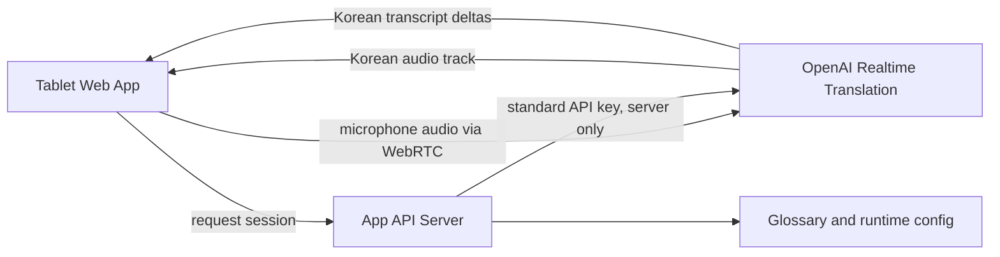

# Tablet Japanese-to-Korean Realtime Translation MVP Design

Date: 2026-05-14
Status: Approved for MVP planning

## Goal

Build a tablet-first web app for face-to-face meetings where Japanese speech is translated into Korean speech and Korean live captions. The first version is intentionally scoped to in-person meetings, not Zoom, Teams, or multi-platform meeting capture.

## Primary Scenario

A Korean-speaking staff member brings a tablet PC into a meeting. A Japanese speaker talks near the tablet or a connected external microphone. The app streams Japanese audio to OpenAI Realtime Translation and plays Korean translated audio while showing large Korean captions.

## Non-Goals For MVP

- Video meeting platform integration.
- Speaker diarization across many participants.
- Korean-to-Japanese reverse interpretation.
- Persistent meeting transcript storage by default.
- Native mobile apps.
- Complex admin dashboards.

## Recommended Architecture

Use a browser WebRTC connection from the tablet to OpenAI Realtime Translation. Keep the standard OpenAI API key only on the backend. The backend issues short-lived translation client secrets and serves environment-specific configuration.



## Components

### Tablet Web App

Responsibility: Provide a meeting-friendly UI, capture microphone audio, establish the WebRTC translation call, play Korean audio, and render Korean captions.

Expected controls:

- Start and stop interpretation.
- Mute translated audio.
- Show Korean captions in large type.
- Toggle Japanese source transcript when available.
- Show microphone, connection, and translation status.
- Choose input device when the browser supports it.

### App API Server

Responsibility: Protect the OpenAI API key, create short-lived Realtime Translation client secrets, provide static app configuration, and later expose lightweight operational metrics.

Initial endpoints:

- `POST /api/realtime/session`: creates a translation client secret for Japanese-to-Korean.
- `GET /api/config`: returns app defaults such as source language, target language, glossary version, and UI flags.
- `GET /healthz`: supports Docker and load balancer health checks.

### OpenAI Realtime Translation

Responsibility: Receive Japanese audio and return Korean translated audio and transcript events. Use the dedicated translation endpoint and a translation model rather than treating this as a generic voice-agent conversation.

## Docker-Ready Deployment Shape

The MVP should be coded as a single repository that can run locally without Docker and later run through Docker Compose.

Recommended initial shape:

```text
realtime_translation/
  apps/
    web/      # React/Vite tablet UI
    api/      # Node/Express API for session minting
  docker/
    nginx/    # optional reverse proxy config for production
  docs/
  docker-compose.yml
  .env.example
```

MVP containers:

- `api`: Node API server, owns `OPENAI_API_KEY`.
- `web`: static frontend build served by nginx or a lightweight Node static server.
- Optional later `reverse-proxy`: nginx or Caddy for TLS, routing, and compression.

For the first local iteration, the web app can run with Vite and the API can run with Node. The code should still use environment variables and health checks so containerization is straightforward.

## Runtime Configuration

Required environment variables:

- `OPENAI_API_KEY`: server-side only.
- `OPENAI_REALTIME_TRANSLATION_MODEL`: default translation model.
- `SOURCE_LANGUAGE`: default `ja`.
- `TARGET_LANGUAGE`: default `ko`.
- `PUBLIC_API_BASE_URL`: browser-visible API origin.

Optional environment variables:

- `APP_REQUIRE_AUTH`: disabled for local MVP, enabled before internal rollout.
- `GLOSSARY_PATH`: path to company terminology JSON.
- `SESSION_MAX_MINUTES`: guardrail for runaway sessions.

## UX Requirements

- First viewport is the actual interpretation console, not a marketing page.
- Tablet landscape and portrait layouts must both be usable.
- Captions must be readable at arm's length in a meeting room.
- Start and stop states must be obvious.
- Error messages should name recoverable actions: microphone permission, network connection, API session creation, or audio playback.
- Avoid dense controls during active interpretation.

## Privacy And Data Handling

MVP default: do not persist audio or transcripts. Captions may exist only in browser memory during the session. If transcript saving is added later, require explicit meeting-level opt-in and show a visible recording/storage indicator.

The API server should not log raw transcript text by default. Operational logs should include session start, session end, error class, and duration.

## Testing Strategy

- Unit test API session request validation and config loading.
- Browser test the tablet UI states: idle, connecting, active, error, stopped.
- Manual device tests on a Windows tablet and at least one mobile/tablet browser.
- Field test with real Japanese speech in a quiet room and a normal meeting room.
- Measure perceived delay, caption readability, reconnection behavior, and microphone quality.

## Risks

| Risk | Impact | Mitigation |
| --- | --- | --- |
| Tablet microphone quality is poor in meeting rooms | High | Support external microphone selection and document recommended hardware. |
| Browser autoplay or audio permissions block playback | Medium | Require user gesture on Start and show clear permission state. |
| Translation delay feels too long for rapid speech | High | Set expectations for brief pauses, test with real meetings, tune instructions and UI. |
| API key leaks into browser bundle | High | Only mint short-lived client secrets from the server. Add checks before deploy. |
| Docker deployment needs HTTPS for microphone/WebRTC | Medium | Plan reverse proxy/TLS before internal rollout. |

## MVP Acceptance Criteria

- A user can open the web app on a tablet, press Start, grant microphone permission, and receive Korean translated audio from Japanese speech.
- Korean captions update live and remain readable on tablet screens.
- OpenAI standard API key is never shipped to the browser.
- The app can run locally with separate web and API processes.
- The project structure is ready for Docker Compose packaging.
